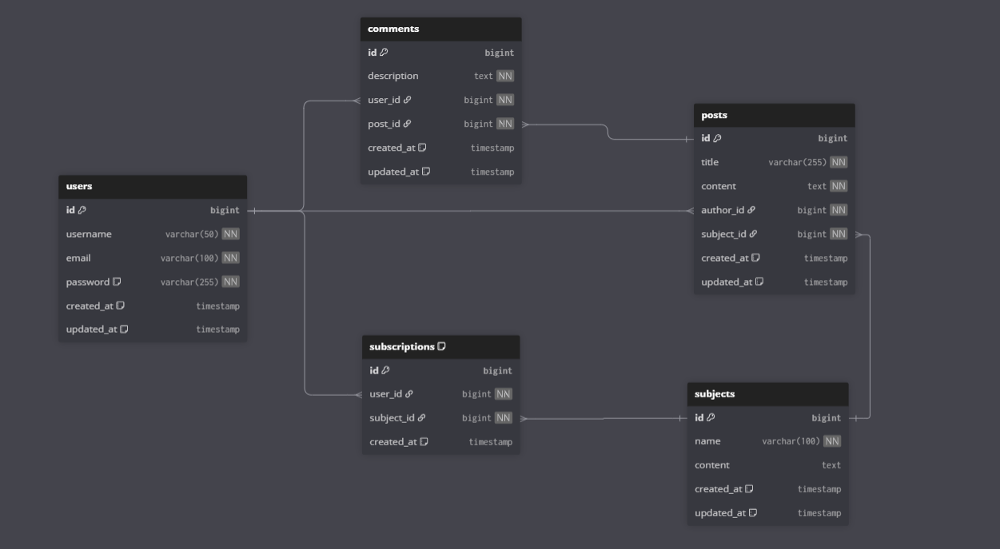

# P6 – Monde de dev

## 📌 Description

MDD is a full-stack platform designed to provide users interested in programming a personalized newsfeed full of relevant content.

## 🚀 Features
- **Authentication:** Sign-up and login with JWT
- **User management:** Profile information and update
- **Subjects:** Consulting subjects and subscribe/unsubscribe to them
- **Posts:** Create post linked to a specific subject
- **Comments:** Add comments linked to posts
- **Security:** Endpoints protected with JWT tokens and guards
- **API documentation:** Swagger / OpenAPI integration

## 🛠️ Technologies Used
**Backend:**
- Java 21
- Spring Boot (Web, Security, Data JPA)
- JWT (JSON Web Tokens)
- MySQL
- Maven
- Lombok
- MapStruct
- Swagger / OpenAPI

**Frontend:**
- Angular 20
- Angular Material
- Tailwind CSS
- TypeScript
- RxJS

## 🛠️ Architecture back end

```bash
src/
└── main/
    ├── java/com/openclassroom/mddapi/
    │   ├── configuration/       # Security and Swagger configuration
    │   ├── controller/          # REST controllers
    │   ├── dto/                 # Request/response DTOs
    │   ├── entity/              # JPA entities
    │   ├── exception/           # Custom exception handling
    │   ├── mapper/              # MapStruct mappers
    │   ├── repository/          # JPA repositories
    │   └── service/             # Business logic services
    └── resources/
        ├── application.properties
        └── schema.sql
```





## 🛠️ Architecture front end

```bash
src/
└── app/
    ├── core/                     # Global services and utilities
    │   ├── guards/               # Navigation/auth guards
    │   ├── interceptors/         # HTTP interceptors
    │   ├── interfaces/           # Shared TypeScript interfaces
    │   └── services/             # Reusable services
    │
    ├── features/                 # Main features
    │   ├── auth/                 # Authentication and user management
    │   ├── comments/             # Comment management
    │   ├── posts/                # Post management
    │   ├── subjects/             # Subject management
    │   └── users/                # User management
    │
    ├── layout/                   # Global layout and shared components
    │
    └── shared/                   # Code shared across multiple modules
        └── validators/           # Reusable validators

```

## 🚀 Installation

### Setup & Run

#### 1. Clone the repository:

```bash
   git clone https://github.com/hisarandre/P6_mdd.git
   cd P6_mdd
```

#### 2. Configure the database:

- Make sure MySQL is installed and running
- Log in to your MySQL database
- Create a database for the application `CREATE DATABASE mdd;`
- Import the schema.sql file located in the resources folder at the project root to initialize the schema
- Verify that the database contains the necessary tables after the import.

#### 3. Configure the environment:

Create an "application.properties" file in the back/src/main/resources by copying from the example below and make sure to complete it:

```bash
server.port=8080

# JWT
jwt.secret=

# Database
spring.datasource.url=
spring.datasource.username=
spring.datasource.password=
spring.jpa.hibernate.ddl-auto=update
```

#### 4. Launch back end

```bash
cd back
mvn clean install
mvn spring-boot:run
```

#### 5. Launch the frontend:
```bash
cd front
npm install
ng serve
```

## 🗂️ Testing

- **User test:**
login: user@test.com
password: Test!123


- **Postman Collection:**
  A Postman collection is included in the project to test endpoints. It is located in the backend resources/mdd.postman_collection in the back end file.

## 👉 API Documentation
Swagger UI is available here after starting up: http://localhost:8080/swagger-ui.html